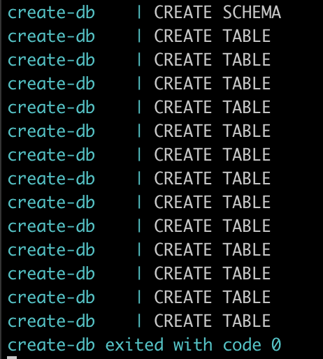

# **TP Final Foundations**

La base de datos elegida para esta trabajo, es una correspondiente a información sobre las carreras de Fórmula 1 (F1).
Los datos los consigo de este [sitio](http://ergast.com/mrd/db/), y contiene datos de todas las carreras de la F1 desde el 5 de Mayo de 1950, hasta la última que ocurrió el 11 de octubre de 2020. Estos datos se actualizan unos minutos terminada cada carrera y tiene información de toodo tipo:

- resultados de las carreras, con las posiciones de todos los pilotos que la corrieron
- datos de las clasificaciones (las carreras del dia previo que definen las posiciones de largada)
- datos de los equipos
- datos de los pilotos
- datos de las paradas en los boxes
- datos de los circuitos


Elegí esta base de datos, por mi interés en la F1, y porque seguramente encuentre cosas super interesantes cuando me ponga a consultar esta iniformación. 

Este trabajo consta de 3 partes, que mediante Docker, Python y SQL, se debe:
 - levantar una base de datos (elegí usar PostgreSQL) y crear la estructura de las tablas.
 - popular esa base de datos con los datos de la F1.
 - realizar consultas sobre esa base de datos.


## **Base de Datos**

Como comenté, elegí usar PostgreSQL como base de datos para guardar toda la información de la F1.
La vamos a levantar mediante un container de Docker. Para ello, tenemos que ejeuctar los siguientes comandos, suponiendo que estamos parados sobre la ruta principal de este directorio:

```
$ cd db
$ docker build -t postgres_local .
````

donde:
- `-t` es el nombre que le ponemos a la imagen , para luego identificarla cuando la querramos correr

```
$ docker run --rm --name pg-docker -e POSTGRES_PASSWORD=docker -d -p 5432:5432 postgres_local
```

donde:
- `--rm` es una buena práctica automáticamente remover el container
- `--name` es el nombre con el que nos vamos a referir al container una vez que esta corriendo
- `-e` le pasamos la variable de entorno, en este caso es la contraseña para la base de datos
- `-d` para que corra en segundo plano
- `-p` enlaza nuestro puerto 5432 con el puerto 5432 del container

Una vez que ya este corriendo, ingresamos a la terminal del container para ejecutar un script de bash y crear la estructura de las tablas. Para eso, ejecutamos lo siguiente:
```
$ docker exec -it pg-docker bash
```
Una vez dentro del container, ejecutamos el script de bash:
```
$ ./create_database.sh
````

Vamos a ver que nos va a listar los comandos que esta realizando, si todo sale bien, deberiamos ver lo siguiente loggeado en la consola:



Ya podemos salir de la terminal del container:
```
$ exit
````

Ok, ya tenemos levantada la base de datos, con las tablas y relaciones creadas.
A su vez, podemos graficar el diagrama ER de la base para entender cuales son estas relaciones:


## **ETL**

Una vez que ya tenemos la base de datos corriendo, iniciamos el proceso de ETL de los datos. Este proceso consiste en decargar los datos crudos desde internet, hacerle una pequeña modificación e insertarlos en cada tabla correspondiente.

Para esto, volvemos al directorio principal del proyecto e ingresamos al directorio `/etl`, y buildeamos la imagen de Docker que contiene el script de Python con el proceso de ETL.

```
$ cd ../
$ cd etl
$ docker build -t etl .
$ docker run --rm --link pg-docker:pg-docker etl
```

donde:
- `--link` sirve para conectarnos a `pg-docker` (que es el container que levantamos en el paso anterior que tiene la base de datos), desde este container que estamos levantando.

Habiendo ejecutado ese comando, vamos a ver los logs impresos en la terminal de que estan insertando los valores en cada tabla correspondiente


## **Reportes**

Ahora que ya tenemos la base de datos populada con toda la información podemos empezar a realizarle consultas para obtener nuevos insights y sacarle valor a los datos.

Para ejecutar estos reportes, buildeamos y corremos la imagen de Docker que se encuentra en el directorio `/reports`:

```
$ cd ../
$ cd reports
$ docker build -t reports .
$ docker run --rm --link pg-docker:pg-docker reports
```
Acá vamos a ver como se van imprimiendo los resultados de las queries en la terminal. Es importante notar que segun la fecha en la que se ejecuten las queries, los resultados pueden variar levemente a los que yo voy a presentar, dado que esta información se va actualizando con las nuevas carreras.

Inspeccionemos los resultados de cada query:

### Query 1

Realizando esta consulta, obtenemos los pilotos que terminaron en una posicion menor o igual a 10 en las carrreras de los ultimos 5 años. Tambien devolvemos la cantidad de veces que hicieron la vuelta mas rapida de la carrera. Los resultados estan ordenados decrecientemente por la cantidad de puntos obtienidos en estos 5 años. 

Obvio que encontramos que los dos piolotos de Mercedez (Hamilton y Bottas) estan ahi arriba, pero lo que si es interesante, es encontrar a Sergio Perez en la posicion 8. Quizas los directivos de Force India realizaron esta query cuando decidieron no renovarle a Esteban Ocon y quedarse con Perez en el 2018, que fue muy criticada por la proyección que tenía Ocon.


### Query 2

Aca obtenemos los pilotos que en los ultimos 5 años tengan mas de 5 carrreras corridas, ordenados por los puntos promedio por carrera obtenidos.

Volvemos a encontrar que Perez es algo superior que Esteban Ocon, y obvio que los top pilotos de los ultimos 5 años estan ahi primeros.


### Query 3

En este reporte, encontramos la proporción de pilotos en toda la historia,que largando en las distintas posiciones, llegaron en primer lugar al final de la carrera. O sea, el 42% de pilotos que largaron en primer lugar, terminaron ganando la carrera, mientras que el 24% de los que la arrancaron en segundo lugar, levantaron el título.

Haciendo un análisis parecido, llegamos a que el 63% de los que largaron en la primer posición, llegaron en primer, segundo o tercer lugar. Mientras que el 54% de los pilotos que largaron en segundo lugar, se subieron al podio.

Es muy claro como se acortan las chances de ganar o subirse al podio a medida que arrancas más lejos de la carrera, dejandole un papel fundamental a la qualy del dia anterior (la que define la posición de largada)


### Query 4

Ahora bien, viendo el reporte anterior, encontramos que hubo pilotos que largaron bastante atras e igual se subieron al podio.

Busquemos los pilotos que hayan largado una carrera despues de la posicion 15 (grid), pero que hayan terminado en el podio (1, 2 o 3) y la fecha en que realizaron tremenda hazaña. Ordenado por las carreras en las que el piloto arrancó desde más atras.


### Query 5

En este reporte entendemos que tanto suelen cambiarse de equipo los piolotos, se imprime la proporcion de pilotos que hayan tenido mas de uno, dos o tres equipos en los ultimos 5 años


### Query 6

Aca nos centramos más en los equipos y su performance en términos de paradas en los boxes: cual fue su menor parada (en milisegundos), cual fue el tiempo promedio de paradas (en milisegundos) y cuantas veces fueron la parada mas rapida de la carrera


### Query 7

Aca respondemos la pregunta que nos estamos haciendo todos (o deberiamos). 

**Schumacher vs Hamilton**: quien es el rey de la F1?
Vemos que con la victoria de este domingo 11/10 en el GP de Eifel, Hamilton lo empato a Schumacher en la cantidad de carreras ganadas, solo que Hamilton lo hizo en menos carreras, llegando a ganar el 34.8% de sus carreras (y 61.3% de podios), mientras que Schumacher gano el 29,5% de todas las carreras y ese subió al podio en el 50.3%.

Obviamente que son dos mosntruos de la F1, y no queda otra que disfrutar de las carreras de Hamilton que sigue estando vigente.


Aca hay una [nota](https://www.infobae.com/deportes/2020/10/12/hamilton-alcanzo-el-record-historico-de-schumacher-es-el-mejor-piloto-en-la-historia-de-la-formula-1/) publicada en Infobae después de la carrera  del 11/10, donde realizan estas y otras comparaciones entre Shcumacher y Hamilton.