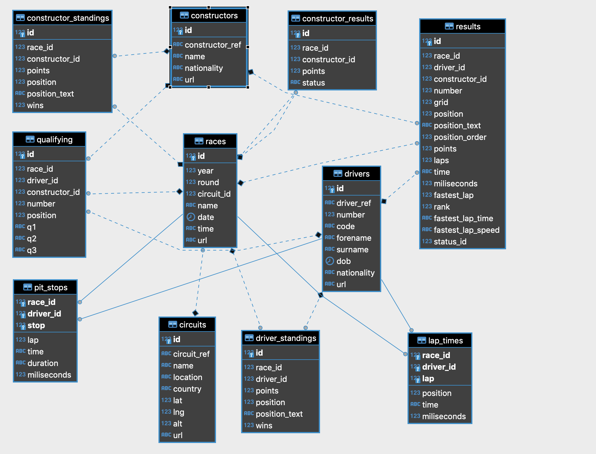

# **TP Final Foundations & Cloud Architect**
 
La base de datos elegida para este trabajo, es una correspondiente a la información sobre las carreras de Fórmula 1 (F1).
Los datos los consigo de este [sitio](http://ergast.com/mrd/db/), y contiene datos de todas las carreras de la F1 desde el 5 de Mayo de 1950, hasta la última que ocurrió el 11 de octubre de 2020. Estos datos se actualizan unos minutos terminada cada carrera y tiene información de todo tipo, entre los que se destacan:
 
- resultados de las carreras, con las posiciones de todos los pilotos que la corrieron.
- datos de las clasificaciones (las carreras del día previo que definen las posiciones de largada).
- datos de los equipos.
- datos de los pilotos.
- datos de las paradas en los boxes.
- datos de los circuitos.
- datos de cada vuelta, de cada circuito para cada piloto que la corrió.
 
 
Elegí esta base de datos, por mi interés en la F1, y porque seguramente encuentre cosas super interesantes cuando me ponga a consultar esta información.
 
Este trabajo consta de 3 partes, que mediante Docker, Python y SQL, se debe:
- levantar una base de datos (elegí usar PostgreSQL) y crear la estructura de las tablas.
- popular esa base de datos con los datos de la F1.
- realizar consultas sobre esa base de datos.
 
## **Estructura del Proyecto**
El proyecto está separado en distintos directorios, uno para cada parte del proceso:
- `/db` tiene los scripts y Dockerfile necesarios para la creación de la base de datos.
- `/etl` tiene los scripts, archivos y Dockerfile necesarios para ejecutar el proceso de ETL.
- `/reports` tiene los scripts, queries, archivos y Dockerfile necesarios para construir los reportes consultando la base de datos.
- `/assets` tiene las imágenes que están incluidas en este README.
 
Ósea, generando un árbol del directorio, obtenemos lo siguiente:
 
```
📦tp-itba-foundations
  - Archivos .PNG utiles para el README.md
┣ 📂assets
┃ ┗ ...
  - Archivos referentes a la base de datos
┣ 📂db
┃ ┣ 📜Dockerfile
┃ ┣ 📜docker-compose.yml
┃ ┣ 📜create_database.sh
┃ ┗ 📜init.sql
  - Archivos referentes a la ejecución del ETL
┣ 📂etl
┃ ┣ 📜Dockerfile
┃ ┣ 📜config.json
┃ ┣ 📜etl.py
┃ ┗ 📜requirements.txt
  - Archivos referentes a la generación de reportes
┣ 📂reports
┃ ┣ 📂queries
┃ ┃ ┣ 📜query_1.sql
┃ ┃ ┣ 📜query_2.sql
┃ ┃ ┣ 📜query_3.sql
┃ ┃ ┣ 📜query_4.sql
┃ ┃ ┣ 📜query_5.sql
┃ ┃ ┣ 📜query_6.sql
┃ ┃ ┗ 📜query_7.sql
┃ ┣ 📜Dockerfile
┃ ┣ 📜config.json
┃ ┣ 📜reports.py
┃ ┗ 📜requirements.txt
┣ 📜README.md
┗ 📜Trabajo Practico - CDE - Foundations.pdf
```
 
## **Tecnologías y Versiones**
Es importante remarcar que este trabajo se realizó con las siguientes tecnologías y versiones:
- Docker (version: 19.03.13, API version: 1.40)
- Docker Compose (version: 1.27.4)
 
## **Docker Network**
Primero vamos a crear la red en la que van a correr todos los containers. De esta manera podemos comunicar los containers entre si. Ejecutamos el siguiente comando que crea la red _tp-itba_:
 
```
$ docker network create tp-itba
```
 
## **Base de Datos**
 
Como comenté, elegí usar PostgreSQL como base de datos para guardar toda la información de la F1.
 
La vamos a levantar mediante docker compose. Esto va a levantar la base de datos (va a buildear y correr una imagen de postgres), va a esperar a que la base esté operativa, y después va a correr el container generado por la imagen que está en el directorio `/db`, que contiene un script de bash que ejecuta un script de sql que crea todas las tablas necesarias. A su vez, indicamos en el docker-compose.yml, que se conecte a la red previamente creada, así podemos comunicarnos con el resto de los containers.
 
Tanto la definición de los campos de las tablas como las foreign keys, las obtengo de [acá](http://ergast.com/schemas/f1db_schema.txt).
 
Para lograr todo esto, ejecutamos los siguientes comandos,suponiendo que estamos en la ruta principal del proyecto:
```
$ cd db
$ docker-compose up
```
 
Vamos a ver que primero va a pullear la imagen de `postgres:13.0`, luego buildea la imagen de `create-db`, luego crea `pg-docker` (osea, corre la imagen de postgres) y al final crea `create-db`. Si todo sale bien, vamos a ver que se crearon las tablas correctamente:
 

 
Ok, ya tenemos levantada la base de datos, con las tablas y relaciones creadas. A su vez, podemos graficar el diagrama ER de la base para entender cuáles son estas relaciones:
 

 
## **ETL**
 
Una vez que ya tenemos la base de datos corriendo, iniciamos el proceso de ETL de los datos. Este proceso consiste en descargar los datos crudos desde internet, hacerle una pequeña modificación e insertarlos en cada tabla correspondiente.
 
Para esto, abrimos otra terminal y nos dirigimos al directorio `/etl` de este proyecto, y buildeamos la imagen de Docker que contiene el script de Python con el proceso de ETL.
 
```
$ cd etl
$ docker build -t etl .
```
 
donde:
- `-t` es el tag con el que creamos la imagen, como nos vamos a referir a ella cuando queramos correrla.
 
Una vez buildeada, ya podemos ejecutarla.
 
 
```
$ docker run --rm -e DATABASE_HOST=pg-docker \
-e DATABASE_PORT=5432 \
-e DATABASE=postgres \
-e DATABASE_USER=postgres \
-e DATABASE_PASSWORD=docker \
--network=tp-itba etl
```
 
donde:
- `--rm` es una buena práctica automáticamente remover el container.
- `-e` le pasamos algunas variables de entorno, en este caso las relacionadas a la base de datos, para poder conectarnos. Acá se ve como el DATABASE_HOST es el nombre con el que llamamos al container de la imagen que se encuentra en /db (tal como está especificado en el archivo docker-compose.yml de ese directorio). Por eso es importante haber definido un nombre.
- `--network` conecta el container a la red `tp-itba` que creamos al principio de todo.
 
Habiendo ejecutado ese comando, vamos a ver los logs impresos en la terminal de que se descargó la base de la F1, y se están insertando en cada tabla correspondiente, y al final de todo el script, define los constraints de las foreign keys entre las distintas tablas:
 

 
## **Reportes**
 
Ahora que ya tenemos la base de datos populada con toda la información podemos empezar a realizarle consultas para obtener nuevos insights y sacarle valor a los datos.
 
Para ejecutar estos reportes, buildeamos y corremos la imagen de Docker que se encuentra en el directorio `/reports`:
 
```
$ cd ../reports
$ docker build -t reports .
$ docker run --rm -e DATABASE_HOST=pg-docker \
-e DATABASE_PORT=5432 \
-e DATABASE=postgres \
-e DATABASE_USER=postgres \
-e DATABASE_PASSWORD=docker \
-v $PWD/results:/app/results \
--network=tp-itba reports
```
Donde los argumentos son iguales al caso del ETL, excepto por el `-v`, este argumento nos monta un directorio `/results` (en este caso también lo crea, dado que no existe) de nuestro sistema, con el directorio `/app/results` del container. Ese directorio es donde se van a guardar los resultados de las queries, por si queremos persisitir los resultados.
 
NOTA: La sintaxis de `$PWD/results` que indica la ruta de nuestro sistema, puede variar un poco según el sistema operativo desde el que se esté corriendo el comando (este ejemplo es para MacOS).
 
Acá vamos a ver cómo se van imprimiendo los resultados de las queries en la terminal. Es importante notar que según la fecha en la que se ejecute el proceso anterior, los resultados pueden variar levemente a los que yo voy a presentar, dado que esta información se va actualizando con las nuevas carreras.
 
Inspeccionemos los resultados de cada query:
 
### Query 1
 
Realizando esta consulta, obtenemos los pilotos que terminaron en una posición menor o igual a 10 en las carrreras de los ultimos 5 años. También devolvemos la cantidad de veces que hicieron la vuelta más rápida de la carrera y los puntos obtenidos en estos 5 años. Los resultados están ordenados decrecientemente por la cantidad de puntos obtienidos en estos 5 años.
 
Obvio que encontramos que los dos pilotos de Mercedez (Hamilton y Bottas) están ahí arriba, pero lo que sí es interesante, es encontrar a Sergio Perez en la posición 8. Quizás los directivos de Force India realizaron esta query cuando decidieron no renovarle a Esteban Ocon y quedarse con Perez en el 2018, que fue muy criticada por la proyección que tenía Ocon.
 

 
### Query 2
 
Acá obtenemos los pilotos que en los últimos 5 años tengan mas de 5 carreras corridas, traemos los puntos promedios por carrera y la cantidad de carreras corridas, ordenados por los puntos promedio por carrera obtenidos.
 
Volvemos a encontrar que Perez es algo superior que Esteban Ocon, y obvio que los top pilotos de los últimos 5 años estan ahi primeros.
 

 
### Query 3
 
En este reporte, encontramos la proporción de pilotos en toda la historia, que largando en las distintas posiciones, llegaron en primer lugar al final de la carrera. O sea, el 42% de pilotos que largaron en primer lugar, terminaron ganando la carrera, mientras que el 24% de los que la arrancaron en segundo lugar, levantaron el título.
 
Haciendo un análisis parecido, llegamos a que el 63% de los que largaron en la primera posición, llegaron en primer, segundo o tercer lugar. Mientras que el 54% de los pilotos que largaron en segundo lugar, se subieron al podio.
 
Es muy claro cómo decrecen las chances de ganar o subirse al podio a medida que arrancas más lejos de la carrera, dejándole un papel fundamental a la qualy del dia anterior (la que define la posición de largada)
 

 
### Query 4
 
Ahora bien, viendo el reporte anterior, encontramos que hubo pilotos que largaron bastante atrás e igual se subieron al podio.
 
Busquemos los pilotos que hayan largado una carrera después de la posición 15 (grid), pero que hayan terminado en el podio (1, 2 o 3) y la fecha en que realizaron tremenda hazaña. Ordenado por las carreras en las que el piloto arrancó desde más atrás.
 

 
### Query 5
 
En este reporte entendemos que tanto suelen cambiarse de equipo los pilotos, se imprime la proporción de pilotos que hayan tenido más de uno, dos o tres equipos en los últimos 5 años
 

 
### Query 6
 
Aca nos centramos más en los equipos y su performance en términos de paradas en los boxes: cual fue su menor parada (en milisegundos), cual fue el tiempo promedio de paradas (en milisegundos) y cuantas veces fueron la parada más rápida de la carrera
 

 
### Query 7
 
Aca respondemos la pregunta que nos estamos haciendo todos (o deberíamos).
 
**Schumacher vs Hamilton**: quien es el rey de la F1?
Vemos que con la victoria de la última carrera disputada el domingo 11/10 en el GP de Eifel, Hamilton lo empato a Schumacher en la cantidad de carreras ganadas, solo que Hamilton lo hizo en menos carreras, llegando a ganar el 34.8% de sus carreras y registrando 61.3% de podios, mientras que Schumacher gano el 29.5% de todas las carreras y ese subió al podio en el 50.3%.
 
Obviamente que son dos monstruos de la F1, y no queda otra que disfrutar de las carreras de Hamilton que sigue estando vigente.
 

 
Aca hay una [nota](https://www.infobae.com/deportes/2020/10/12/hamilton-alcanzo-el-record-historico-de-schumacher-es-el-mejor-piloto-en-la-historia-de-la-formula-1/) publicada en Infobae después de la carrera  del 11/10, donde realizan estas y otras comparaciones entre Shcumacher y Hamilton.
 
## **Clean Up**
Una vez que obtuvimos los insights necesarios, ya podemos limpiar todo el proyecto. Para eso, abrimos otra terminal en `/db`:
```
$ docker-compose down
```
 
Con este comando, dejamos de exponer la base de datos. Ahora ya podemos remover la red creada al principio de todo:
```
$ docker network rm tp-itba
```